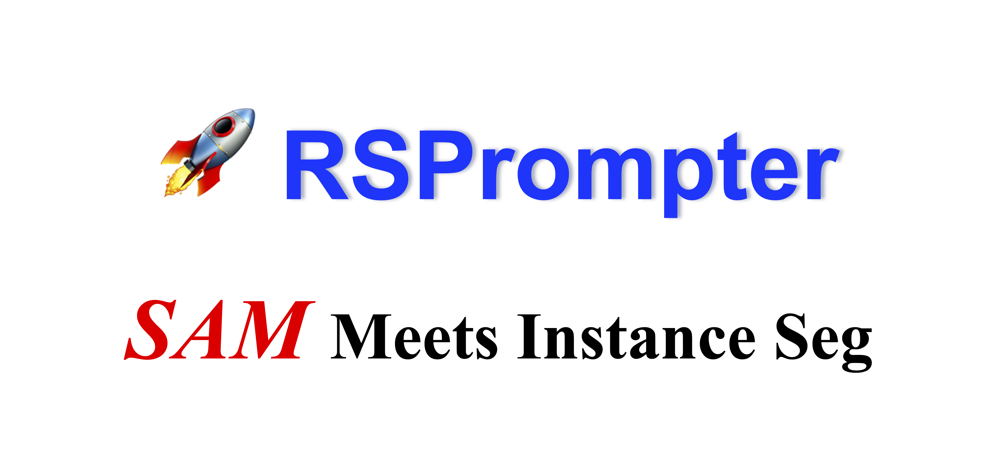

<div align="center">
    <h2>
        RSPrompter: Learning to Prompt for Remote Sensing Instance Segmentation based on Visual Foundation Model
    </h2>
</div>
<br>

<div align="center">
  
</div>
<br>
<div align="center">
  <a href="https://kychen.me/RSPrompter">
    <span style="font-size: 20px; ">Project Page</span>
  </a>
  &nbsp;&nbsp;&nbsp;&nbsp;
  <a href="https://arxiv.org/abs/2306.16269">
    <span style="font-size: 20px; ">arXiv</span>
  </a>
  &nbsp;&nbsp;&nbsp;&nbsp;
  <a href="https://huggingface.co/spaces/KyanChen/RSPrompter">
    <span style="font-size: 20px; ">HFSpace</span>
  </a>
</div>
<br>
<br>

[](https://github.com/KyanChen/RSPrompter)
[](LICENSE)
[](https://arxiv.org/abs/2306.16269)
[](https://huggingface.co/spaces/KyanChen/RSPrompter)

<br>
<br>

<div align="center">

English | [简体中文](README_zh-CN.md)

</div>


## Introduction

This repository is the code implementation of the paper [RSPrompter: Learning to Prompt for Remote Sensing Instance Segmentation based on Visual Foundation Model](https://arxiv.org/abs/2306.16269), which is based on the [MMDetection](https://github.com/open-mmlab/mmdetection/tree/main) project.

The current branch has been tested under PyTorch 2.x and CUDA 12.1, supports Python 3.7+, and is compatible with most CUDA versions.

If you find this project helpful, please give us a star ⭐️, your support is our greatest motivation.

<details open>
<summary>Main Features</summary>

- A highly consistent API interface and usage method with MMDetection
- Open source SAM-seg, SAM-det, RSPrompter and other models in the paper
- Tested with AMP, DeepSpeed and other training methods
- Support training and testing of multiple datasets

</details>

## Update Log

🌟 **2023.06.29** Released the RSPrompter project, which implements the SAM-seg, SAM-det, RSPrompter and other models in the paper based on Lightning and MMDetection.

🌟 **2023.11.25** Updated the code of RSPrompter, which is completely consistent with the API interface and usage method of MMDetection.

## TODO

- [X] Consistent API interface and usage method with MMDetection
- [ ] Reduce the memory usage of the model while ensuring performance by reducing the image input and combining with the large model fine-tuning technology
- [ ] Dynamically variable image size input
- [ ] Efficient fine-tuning method in the model
- [ ] Add SAM-cls model

## Table of Contents

- [Introduction](#Introduction)
- [Update Log](#Update-Log)
- [TODO](#TODO)
- [Table of Contents](#Table-of-Contents)
- [Installation](#Installation)
- [Dataset Preparation](#Dataset-Preparation)
- [Model Training](#Model-Training)
- [Model Testing](#Model-Testing)
- [Image Prediction](#Image-Prediction)
- [Common Problems](#Common-Problems)
- [Acknowledgement](#Acknowledgement)
- [Citation](#Citation)
- [License](#License)
- [Contact](#Contact)

## Installation

### Dependencies

- Linux or Windows
- Python 3.7+, recommended 3.10
- PyTorch 2.0 or higher, recommended 2.1
- CUDA 11.7 or higher, recommended 12.1
- MMCV 2.0 or higher, recommended 2.1

### Environment Installation

We recommend using Miniconda for installation. The following command will create a virtual environment named `rsprompter` and install PyTorch and MMCV.

Note: If you have experience with PyTorch and have already installed it, you can skip to the next section. Otherwise, you can follow these steps to prepare.

<details>

**Step 0**: Install [Miniconda](https://docs.conda.io/projects/miniconda/en/latest/index.html).

**Step 1**: Create a virtual environment named `rsprompter` and activate it.

```shell
conda create -n rsprompter python=3.10 -y
conda activate rsprompter
```

**Step 2**: Install [PyTorch](https://pytorch.org/get-started/locally/).

Linux:
```shell
pip install torch torchvision torchaudio
```
Windows:
```shell
pip install torch torchvision torchaudio --index-url https://download.pytorch.org/whl/cu121
```

**Step 3**: Install [MMCV](https://mmcv.readthedocs.io/en/latest/get_started/installation.html).

```shell
pip install -U openmim
mim install "mmcv>=2.0.0"
```

**Step 4**: Install other dependencies.

```shell
pip install -U transformers wandb einops pycocotools shapely scipy terminaltables
```

</details>

### Install RSPrompter

Download or clone the RSPrompter repository.


```shell
git clone git@github.com:KyanChen/RSPrompter.git
cd RSPrompter
```

## Dataset Preparation

<details>

### Basic Instance Segmentation Dataset

We provide the instance segmentation dataset preparation method used in the paper.

#### WHU Building Dataset

- Image download address: [WHU Building Dataset](https://aistudio.baidu.com/datasetdetail/56502)。

- Semantic label to instance label: We provide the corresponding [conversion script](tools/rsprompter/whu2coco.py) to convert the semantic label of WHU building dataset to instance label.

#### NWPU VHR-10 Dataset

- Image download address: [NWPU VHR-10 Dataset](https://aistudio.baidu.com/datasetdetail/52812).

- Instance label download address: [NWPU VHR-10 Instance Label](https://github.com/chaozhong2010/VHR-10_dataset_coco).

#### SSDD Dataset

- Image download address: [SSDD Dataset](https://aistudio.baidu.com/datasetdetail/56503).

- Instance label download address: [SSDD Instance Label](https://github.com/chaozhong2010/VHR-10_dataset_coco).

**Note**: In the `data` folder of this project, we provide the instance labels of the above datasets, which you can use directly.

#### Organization Method

You can also choose other sources to download the data, but you need to organize the dataset in the following format:

```
${DATASET_ROOT} # Dataset root directory, for example: /home/username/data/NWPU
├── annotations
│   ├── train.json
│   ├── val.json
│   └── test.json
└── images
    ├── train
    ├── val
    └── test
```
Note: In the project folder, we provide a folder named `data`, which contains examples of the organization method of the above datasets.

### Other Datasets

If you want to use other datasets, you can refer to [MMDetection documentation](https://mmdetection.readthedocs.io/zh-cn/latest/user_guides/dataset_prepare.html) to prepare the datasets.

</details>

## Model Training

### SAM-based Model

#### Config File and Main Parameter Parsing

We provide the configuration files of the SAM-based models used in the paper, which can be found in the `configs/rsprompter` folder. The Config file is completely consistent with the API interface and usage method of MMDetection. Below we provide an analysis of some of the main parameters. If you want to know more about the meaning of the parameters, you can refer to the [MMDetection documentation](https://mmdetection.readthedocs.io/zh-cn/latest/user_guides/config.html).

<details>

**Parameter Parsing**:

- `work_dir`: The output path of model training, which generally does not need to be modified.
- `default_hooks-CheckpointHook`: Checkpoint saving configuration during model training, which generally does not need to be modified.
- `default_hooks-visualization`: Visualization configuration during model training, **comment out during training and uncomment during testing**.
- `vis_backends-WandbVisBackend`: Configuration of network-side visualization tools, **after opening the comment, you need to register an account on the `wandb` official website, and you can view the visualization results during training in the web browser**.
- `num_classes`: The number of categories in the dataset, **which needs to be modified according to the number of categories in the dataset**.
- `prompt_shape`: The shape of the Prompt, the first parameter represents $N_p$, and the second parameter represents $K_p$, which generally does not need to be modified.
- `hf_sam_pretrain_name`: The name of the SAM model on HuggingFace Spaces, which generally does not need to be modified.
- `hf_sam_pretrain_ckpt_path`: The checkpoint path of the SAM model on HuggingFace Spaces, **which needs to be modified to your own path**, you can use the [download script](https://github.com/KyanChen/RSPrompter/blob/release/tools/rsprompter/download_hf_sam_pretrain_ckpt.py) to download.
- `model-decoder_freeze`: Whether to freeze the parameters of the SAM decoder, which generally does not need to be modified.
- `model-neck-feature_aggregator-hidden_channels`: The hidden channel number of the feature aggregator, which generally does not need to be modified.
- `model-neck-feature_aggregator-select_layers`: The number of layers selected by the feature aggregator, **which needs to be modified according to the selected SAM backbone type**.
- `model-mask_head-with_sincos`: Whether to use sin regularization when predicting prompts, which generally does not need to be modified.
- `dataset_type`: The type of dataset, **which needs to be modified according to the type of dataset**.
- `code_root`: Code root directory, **modify to the absolute path of the root directory of this project**.
- `data_root`: Dataset root directory, **modify to the absolute path of the dataset root directory**.
- `batch_size_per_gpu`: Batch size per card, **which needs to be modified according to the memory size**.
- `resume`: Whether to resume training, which generally does not need to be modified.
- `load_from`: Checkpoint path of the model's pre-training, which generally does not need to be modified.
- `max_epochs`: The maximum number of training rounds, which generally does not need to be modified.
- `runner_type`: The type of trainer needs to be consistent with the type of `optim_wrapper` and `strategy`, which generally does not need to be modified.

</details>


#### Single Card Training

```shell
python tools/train.py configs/rsprompter/xxx.py  # xxx.py is the configuration file you want to use
```

#### Multi-card Training

```shell
sh ./tools/dist_train.sh configs/rsprompter/xxx.py ${GPU_NUM}  # xxx.py is the configuration file you want to use, GPU_NUM is the number of GPUs used
```

### Other Instance Segmentation Models

<details>

If you want to use other instance segmentation models, you can refer to [MMDetection](https://github.com/open-mmlab/mmdetection/tree/main) to train the models, or you can put their Config files in the `configs` folder of this project, and then train them according to the above methods.

</details>

## Model Testing

#### Single Card Testing:

```shell
python tools/test.py configs/rsprompter/xxx.py ${CHECKPOINT_FILE}  # xxx.py is the configuration file you want to use, CHECKPOINT_FILE is the checkpoint file you want to use
```

#### Multi-card Testing:

```shell
sh ./tools/dist_test.sh configs/rsprompter/xxx.py ${CHECKPOINT_FILE} ${GPU_NUM}  # xxx.py is the configuration file you want to use, CHECKPOINT_FILE is the checkpoint file you want to use, GPU_NUM is the number of GPUs used
```

**Note**: If you need to get the visualization results, you can uncomment `default_hooks-visualization` in the Config file.


## Image Prediction

#### Single Image Prediction:

```shell
python demo/image_demo.py ${IMAGE_FILE}  configs/rsprompter/xxx.py --weights ${CHECKPOINT_FILE} --out-dir ${OUTPUT_DIR}  # IMAGE_FILE is the image file you want to predict, xxx.py is the configuration file you want to use, CHECKPOINT_FILE is the checkpoint file you want to use, OUTPUT_DIR is the output path of the prediction result
```

#### Multi-image Prediction:

```shell
python demo/image_demo.py ${IMAGE_DIR}  configs/rsprompter/xxx.py --weights ${CHECKPOINT_FILE} --out-dir ${OUTPUT_DIR}  # IMAGE_DIR is the image folder you want to predict, xxx.py is the configuration file you want to use, CHECKPOINT_FILE is the checkpoint file you want to use, OUTPUT_DIR is the output path of the prediction result
```


## Common Problems

<details>

We have listed some common problems and their corresponding solutions here. If you find that some problems are missing, please feel free to provide PR to enrich this list. If you cannot get help here, please use [issue](https://github.com/KyanChen/RSPrompter/issues) to seek help. Please fill in all the required information in the template, which will help us locate the problem faster.

### 1. Do I need to install MMDetection?

We recommend that you do not install MMDetection because we have made some modifications to the code of MMDetection, which may cause errors in the code if you install MMDetection. If you encounter an error that the module has not been registered, please check:

- Whether MMDetection is installed, if so, uninstall it
- Whether `@MODELS.register_module()` is added in front of the class name, if not, add it
- Whether `from .xxx import xxx` is added in `__init__.py`, if not, add it
- Whether `custom_imports = dict(imports=['mmdet.rsprompter'], allow_failed_imports=False)` is added in the Config file, if not, add it

### 2. How to evaluate the model after training with DeepSpeed?

We recommend that you use DeepSpeed to train the model because DeepSpeed can greatly improve the training speed of the model. However, the training method of DeepSpeed is different from that of MMDetection, so after using DeepSpeed to train the model, you need to use the method of MMDetection to evaluate it. Specifically, you need to:

- Convert the model trained by DeepSpeed to the model of MMDetection, enter the folder where the model is stored, and run

```shell
python zero_to_fp32.py . $SAVE_CHECKPOINT_NAME -t $CHECKPOINT_DIR  # $SAVE_CHECKPOINT_NAME is the name of the converted model, $CHECKPOINT_DIR is the name of the model trained by DeepSpeed
``` 
- Change `runner_type` in the Config file to `Runner`.
- Use the method of MMDetection to evaluate, and you can get the evaluation results.

</details>

## Acknowledgement

This project is developed based on the [MMDetection](https://github.com/open-mmlab/mmdetection/tree/main) project. Thanks to the developers of the MMDetection project.

## Citation

If you use the code or performance benchmarks of this project in your research, please refer to the bibtex below to cite RSPrompter.

```
@article{chen2023rsprompter,
  title={RSPrompter: Learning to prompt for remote sensing instance segmentation based on visual foundation model},
  author={Chen, Keyan and Liu, Chenyang and Chen, Hao and Zhang, Haotian and Li, Wenyuan and Zou, Zhengxia and Shi, Zhenwei},
  journal={arXiv preprint arXiv:2306.16269},
  year={2023}
}
```

## License

This project is licensed under the [Apache 2.0 license](LICENSE).

## Contact

If you have any other questions❓, please contact us in time 👬
