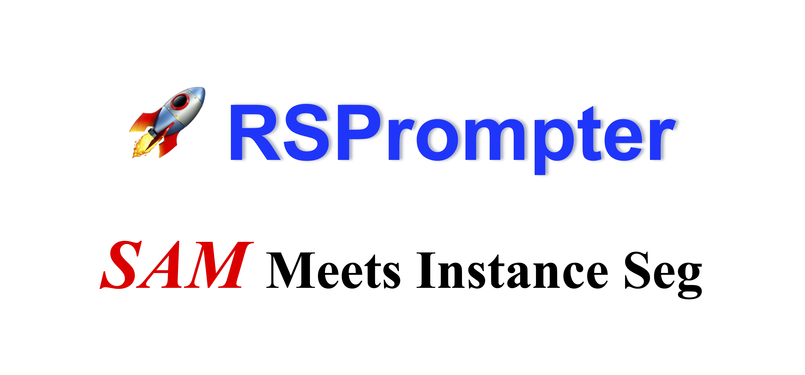

<div align="center">
    <h2>
        RSPrompter: Learning to Prompt for Remote Sensing Instance Segmentation based on Visual Foundation Model
    </h2>
</div>
<br>

<div align="center">
  
</div>
<br>
<div align="center">
  <a href="https://kychen.me/RSPrompter">
    <span style="font-size: 20px; ">项目主页</span>
  </a>
  &nbsp;&nbsp;&nbsp;&nbsp;
  <a href="https://arxiv.org/abs/2306.16269">
    <span style="font-size: 20px; ">arXiv</span>
  </a>
  &nbsp;&nbsp;&nbsp;&nbsp;
  <a href="https://huggingface.co/spaces/KyanChen/RSPrompter">
    <span style="font-size: 20px; ">HFSpace</span>
  </a>
</div>
<br>
<br>

[](https://github.com/KyanChen/RSPrompter)
[](LICENSE)
[](https://arxiv.org/abs/2306.16269)
[](https://huggingface.co/spaces/KyanChen/RSPrompter)

<br>
<br>

<div align="center">

[English](README.md) | 简体中文

</div>


## 简介

本项目仓库是论文 [RSPrompter: Learning to Prompt for Remote Sensing Instance Segmentation based on Visual Foundation Model](https://arxiv.org/abs/2306.16269) 的代码实现，基于 [MMDetection](https://github.com/open-mmlab/mmdetection/tree/main) 项目进行开发。

当前分支在PyTorch 2.x 和 CUDA 12.1 下测试通过，支持 Python 3.7+，能兼容绝大多数的 CUDA 版本。

如果你觉得本项目对你有帮助，请给我们一个 star ⭐️，你的支持是我们最大的动力。

<details open>
<summary>主要特性</summary>

- 与 MMDetection 高度保持一致的 API 接口及使用方法
- 开源了论文中的 SAM-seg、SAM-det、RSPrompter 等模型
- 通过了 AMP、DeepSpeed 等训练方式的测试
- 支持了多种数据集的训练和测试

</details>

## 更新日志

🌟 **2023.06.29** 发布了 RSPrompter 项目，基于Lightning和MMDetection实现了论文中的SAM-seg、SAM-det、RSPrompter等模型。

🌟 **2023.11.25** 更新了RSPrompter的代码，完全与MMDetection保持一致的API接口及使用方法。


## TODO

- [X] 与MMDetection保持一致的API接口及使用方法
- [ ] 通过减小图像输入并结合大模型微调技术在保证性能的同时减小模型的显存占用
- [ ] 动态可变的图像尺寸输入
- [ ] 在模型中加入高效微调的方法
- [ ] 加入SAM-cls模型

## 目录

- [简介](#简介)
- [更新日志](#更新日志)
- [TODO](#TODO)
- [目录](#目录)
- [安装](#安装)
- [数据集准备](#数据集准备)
- [模型训练](#模型训练)
- [模型测试](#模型测试)
- [图像预测](#图像预测)
- [常见问题](#常见问题)
- [致谢](#致谢)
- [引用](#引用)
- [开源许可证](#开源许可证)
- [联系我们](#联系我们)

## 安装

### 依赖项

- Linux 或 Windows
- Python 3.7+，推荐使用 3.10
- PyTorch 2.0 或更高版本，推荐使用 2.1
- CUDA 11.7 或更高版本，推荐使用 12.1
- MMCV 2.0 或更高版本，推荐使用 2.1

### 环境安装

我们推荐使用 Miniconda 来进行安装，以下命令将会创建一个名为 `rsprompter` 的虚拟环境，并安装 PyTorch 和 MMCV。

注解：如果你对 PyTorch 有经验并且已经安装了它，你可以直接跳转到下一小节。否则，你可以按照下述步骤进行准备。

<details>

**步骤 0**：安装 [Miniconda](https://docs.conda.io/projects/miniconda/en/latest/index.html)。

**步骤 1**：创建一个名为 `rsprompter` 的虚拟环境，并激活它。

```shell
conda create -n rsprompter python=3.10 -y
conda activate rsprompter
```

**步骤 2**：安装 [PyTorch](https://pytorch.org/get-started/locally/)。

Linux:
```shell
pip install torch torchvision torchaudio
```
Windows:
```shell
pip install torch torchvision torchaudio --index-url https://download.pytorch.org/whl/cu121
```

**步骤 3**：安装 [MMCV](https://mmcv.readthedocs.io/en/latest/get_started/installation.html)。

```shell
pip install -U openmim
mim install "mmcv>=2.0.0"
```

**步骤 4**：安装其他依赖项。

```shell
pip install -r requirements/build.txt
pip install -r requirements/optional.txt
```

</details>

### 安装 RSPrompter

下载或克隆 RSPrompter 仓库即可。

```shell
git clone git@github.com:KyanChen/RSPrompter.git
cd RSPrompter
```

## 数据集准备

<details>

### 基础实例分割数据集

我们提供论文中使用的实例分割数据集准备方法。

#### WHU 建筑物数据集

- 图片下载地址： [WHU建筑物数据集](https://aistudio.baidu.com/datasetdetail/56502)。

- 语义标签转实例标签：我们提供了相应的[转换脚本](tools/rsprompter/whu2coco.py)来将 WHU 建筑物数据集的语义标签转换为实例标签。

#### NWPU VHR-10 数据集

- 图片下载地址： [NWPU VHR-10数据集](https://aistudio.baidu.com/datasetdetail/52812)。

- 实例标签下载地址： [NWPU VHR-10实例标签](https://github.com/chaozhong2010/VHR-10_dataset_coco)。

#### SSDD 数据集

- 图片下载地址： [SSDD数据集](https://aistudio.baidu.com/datasetdetail/56503)。

- 实例标签下载地址： [SSDD实例标签](https://github.com/chaozhong2010/VHR-10_dataset_coco)。

**注解**：在本项目的 `data` 文件夹中，我们提供了上述数据集的实例标签，你可以直接使用。

#### 组织方式

你也可以选择其他来源进行数据的下载，但是需要将数据集组织成如下的格式：

```
${DATASET_ROOT} # 数据集根目录，例如：/home/username/data/NWPU
├── annotations
│   ├── train.json
│   ├── val.json
│   └── test.json
└── images
    ├── train
    ├── val
    └── test
```
注解：在项目文件夹中，我们提供了一个名为 `data` 的文件夹，其中包含了上述数据集的组织方式的示例。

### 其他数据集

如果你想使用其他数据集，可以参考 [MMDetection 文档](https://mmdetection.readthedocs.io/zh-cn/latest/user_guides/dataset_prepare.html) 来进行数据集的准备。

</details>

## 模型训练

### SAM-based 模型

#### Config 文件及主要参数解析

我们提供了论文中使用的 SAM-based 模型的配置文件，你可以在 `configs/rsprompter` 文件夹中找到它们。Config 文件完全与 MMDetection 保持一致的 API 接口及使用方法。下面我们提供了一些主要参数的解析。如果你想了解更多参数的含义，可以参考 [MMDetection 文档](https://mmdetection.readthedocs.io/zh-cn/latest/user_guides/config.html)。

<details>

**参数解析**：

- `work_dir`：模型训练的输出路径，一般不需要修改。
- `default_hooks-CheckpointHook`：模型训练过程中的检查点保存配置，一般不需要修改。
- `default_hooks-visualization`：模型训练过程中的可视化配置，**训练时注释，测试时取消注释**。
- `vis_backends-WandbVisBackend`：网络端可视化工具的配置，**打开注释后，需要在 `wandb` 官网上注册账号，可以在网络浏览器中查看训练过程中的可视化结果**。
- `num_classes`：数据集的类别数，**需要根据数据集的类别数进行修改**。
- `prompt_shape`：Prompt 的形状，第一个参数代表 $N_p$，第二个参数代表 $K_p$，一般不需要修改。
- `hf_sam_pretrain_name`：HuggingFace Spaces 上的 SAM 模型的名称，一般不需要修改。
- `hf_sam_pretrain_ckpt_path`：HuggingFace Spaces 上的 SAM 模型的检查点路径，**需要修改为你自己的路径**，可以使用[下载脚本](tools/rsprompter/download_hf_sam_pretrain_ckpt.py)来下载。
- `model-decoder_freeze`：是否冻结SAM解码器的参数，一般不需要修改。
- `model-neck-feature_aggregator-hidden_channels`：特征聚合器的隐藏通道数，一般不需要修改。
- `model-neck-feature_aggregator-select_layers`：特征聚合器的选择层数，**需要根据选择的SAM骨干类型进行修改**。
- `model-mask_head-with_sincos`：是否在预测提示时使用 sin 正则化，一般不需要修改。
- `dataset_type`：数据集的类型，**需要根据数据集的类型进行修改**。
- `code_root`：代码根目录，**修改为本项目根目录的绝对路径**。
- `data_root`：数据集根目录，**修改为数据集根目录的绝对路径**。
- `batch_size_per_gpu`：单卡的 batch size，**需要根据显存大小进行修改**。
- `resume`: 是否断点续训，一般不需要修改。
- `load_from`：模型的预训练的检查点路径，一般不需要修改。
- `max_epochs`：最大训练轮数，一般不需要修改。
- `runner_type`：训练器的类型，需要和`optim_wrapper`及`strategy`的类型保持一致，一般不需要修改。

</details>


#### 单卡训练

```shell
python tools/train.py configs/rsprompter/xxx.py  # xxx.py 为你想要使用的配置文件
```

#### 多卡训练

```shell
sh ./tools/dist_train.sh configs/rsprompter/xxx.py ${GPU_NUM}  # xxx.py 为你想要使用的配置文件，GPU_NUM 为使用的 GPU 数量
```

### 其他实例分割模型

<details>

如果你想使用其他实例分割模型，可以参考 [MMDetection](https://github.com/open-mmlab/mmdetection/tree/main) 来进行模型的训练，也可以将其Config文件放入本项目的 `configs` 文件夹中，然后按照上述的方法进行训练。

</details>

## 模型测试

#### 单卡测试：

```shell
python tools/test.py configs/rsprompter/xxx.py ${CHECKPOINT_FILE}  # xxx.py 为你想要使用的配置文件，CHECKPOINT_FILE 为你想要使用的检查点文件
```

#### 多卡测试：

```shell
sh ./tools/dist_test.sh configs/rsprompter/xxx.py ${CHECKPOINT_FILE} ${GPU_NUM}  # xxx.py 为你想要使用的配置文件，CHECKPOINT_FILE 为你想要使用的检查点文件，GPU_NUM 为使用的 GPU 数量
```

**注解**：如果需要获取可视化结果，可以在 Config 文件中取消 `default_hooks-visualization` 的注释。


## 图像预测

#### 单张图像预测：

```shell
python demo/image_demo.py ${IMAGE_FILE}  configs/rsprompter/xxx.py --weights ${CHECKPOINT_FILE} --out-dir ${OUTPUT_DIR}  # IMAGE_FILE 为你想要预测的图像文件，xxx.py 为你想要使用的配置文件，CHECKPOINT_FILE 为你想要使用的检查点文件，OUTPUT_DIR 为预测结果的输出路径
```

#### 多张图像预测：

```shell
python demo/image_demo.py ${IMAGE_DIR}  configs/rsprompter/xxx.py --weights ${CHECKPOINT_FILE} --out-dir ${OUTPUT_DIR}  # IMAGE_DIR 为你想要预测的图像文件夹，xxx.py 为你想要使用的配置文件，CHECKPOINT_FILE 为你想要使用的检查点文件，OUTPUT_DIR 为预测结果的输出路径
```


## 常见问题

<details>

我们在这里列出了使用时的一些常见问题及其相应的解决方案。如果您发现有一些问题被遗漏，请随时提 PR 丰富这个列表。如果您无法在此获得帮助，请使用[issue](https://github.com/KyanChen/RSPrompter/issues)来寻求帮助。请在模板中填写所有必填信息，这有助于我们更快定位问题。

### 1. 是否需要安装MMDetection？

我们建议您不要安装MMDetection，因为我们已经对MMDetection的代码进行了部分修改，如果您安装了MMDetection，可能会导致代码运行出错。如果你出现了模块尚未被注册的错误，请检查：

- 是否安装了MMDetection，若有则卸载
- 是否在类名前加上了`@MODELS.register_module()`，若没有则加上
- 是否在`__init__.py`中加入了`from .xxx import xxx`，若没有则加上
- 是否在Config文件中加入了`custom_imports = dict(imports=['mmdet.rsprompter'], allow_failed_imports=False)`，若没有则加上

### 2. 使用DeepSpeed训练时后如何评测模型？

我们建议您使用DeepSpeed训练模型，因为DeepSpeed可以大幅度提升模型的训练速度。但是，DeepSpeed的训练方式与MMDetection的训练方式不同，因此在使用DeepSpeed训练模型后，需要使用MMDetection的方式进行评测。具体来说，您需要：

- 将DeepSpeed训练的模型转换为MMDetection的模型，进入到存储模型的文件夹，运行
```shell
python zero_to_fp32.py . $SAVE_CHECKPOINT_NAME -t $CHECKPOINT_DIR  # $SAVE_CHECKPOINT_NAME为转换后的模型名称，$CHECKPOINT_DIR为DeepSpeed训练的模型名称
``` 
- 将Config文件中的`runner_type`改为`Runner`。
- 使用MMDetection的方式进行评测，即可得到评测结果。

</details>

## 致谢

本项目基于 [MMDetection](https://github.com/open-mmlab/mmdetection/tree/main) 项目进行开发，感谢 MMDetection 项目的开发者们。

## 引用

如果你在研究中使用了本项目的代码或者性能基准，请参考如下 bibtex 引用 RSPrompter。

```
@article{chen2023rsprompter,
  title={RSPrompter: Learning to prompt for remote sensing instance segmentation based on visual foundation model},
  author={Chen, Keyan and Liu, Chenyang and Chen, Hao and Zhang, Haotian and Li, Wenyuan and Zou, Zhengxia and Shi, Zhenwei},
  journal={arXiv preprint arXiv:2306.16269},
  year={2023}
}
```

## 开源许可证

该项目采用 [Apache 2.0 开源许可证](LICENSE)。

## 联系我们

如果有其他问题❓，请及时与我们联系 👬
